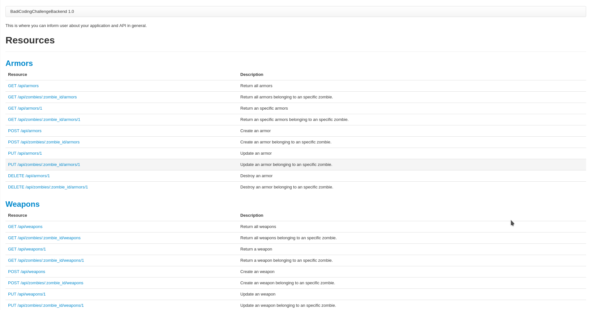
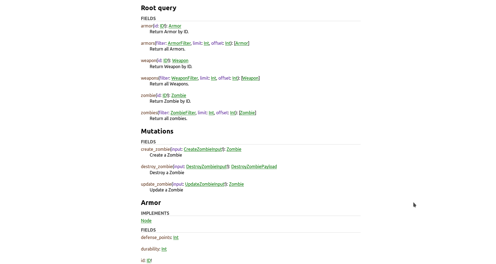

# Badi Coding Challenge - Backend (Ruby on Rails)


## The context
You are a scientist in a post-apocalyptic world. In your lab you have plenty of human tissues, yet not so many brains. For this reason, you decide to create zombies, which you then equip with armors and weapons. Why would you do that? Well, we cannot tell you. The only thing you need to know is that you are a crazy scientist playing on the edge of life and death.

## The Challenge

Create a fully-working API that allows to perform the following operations:

1. Create Zombies. Each zombie can have weapons and armors;
2. Update a Zombie's attributes, including (but not limited to) weapons and armors;
4. Search Zombies according to their attributes, weapons and armors;
3. Destroy a Zombie;
5. Make your API public. Deploy it using the service of your choice (e.g. AWS, Heroku, Digital Ocean...);
6. Create a Readme file including a short explanation of your technical choices and (if you wish) ideas and suggestions.

## Definitions
#### Zombie:
* Must have ```name``` (String value), representing the zombie's name.
* Must have ```speed``` (Integer value), representing the walking speed of the zombie.
* Must have ```turn_date``` (Date value), representing the date when the zombie actually woke up.
* Must have ```hit_points``` (Integer value), representing how much damage can a zombie bite cause.
* Can have ```brains_eaten``` (Integer value), representing how many brains the zombie has eaten during his life(or dead period). Default value: 0.

#### Armor:
* Must have ```name``` (String value), representing the name of the armor.
* Must have ```defense_points``` (Integer value), representing how much damage can a zombie resist with this armor.
* Must have ```durability``` (Integer value); armors aren't forever, a zombie can use it only for a limited time. This field represents this time in minutes.
* Must have ```price``` (Integer value), everything in life has a price and this is the price for having these awesome armors.

#### Weapon:
* Must have ```name``` (String value), representing the name of the weapon.
* Must have ```attack_points``` (Integer value), representing how much damage can a zombie cause with this armor.
* Must have ```durability``` (Integer value); armors aren't forever, a zombie can use it only for a limited time. This field represent this time in minutes.
* Must have ```price``` (Integer value), everything in live has a price and this is the price for having these weapons.

#### Game Rules:
* You can have as many zombies as you want. Create them with different attributes.
* You can assign armors and weapons to your zombies as long as you pay for them (future implementation, so enjoy now, It's for free!).
* Every minute the system will check for your armors and weapons and it will decrement according to the ```durability``` field if you can continue using it or not. Once you get 0 in your counter the system will remove this armor or weapon from your zombie (Check `/sidekiq` path to check the process running, only development mode).

#### Are you talking GraphQL?
If your application talks GraphQL you can consume this API as well.
Use the `/graphql` path to consume the GraphQL API.

#### Documentation:
###### REST API
You can check the documentation at `/documentation` path in the application. You can read about all endpoint and check examples for each endpoint.
To generate a static version of documentation (perhaps to put it on your project site or something), run the `rake apipie:static` task. It will create a set of HTML files (multi-pages, single-page, plain) in your doc directory. If you prefer a JSON version run `rake apipie:static_json`.


###### GraphQL API
To build the documentation about GraphQL API you can install [graphql-docs](https://github.com/gjtorikian/graphql-docs). Reproduce the following steps.
You will need node and npm in your system, follow the [instructions](https://www.npmjs.com/get-npm). After that, install [graphql-docs](https://github.com/gjtorikian/graphql-docs) and reproduce the following steps.
```bash
$ npm install -g graphql-doc
$ graphql-docs-gen http://localhost:3000/graphql documentation.html
```
You will have the documentation in the `documentation.html` file.



Also you can play with the GraphQL API using the editor in this path `/graphiql`.

#### Running the project
###### Using docker-compose
This project is already setup to use docker-compose. Just run `docker-compose up -d && docker-compose logs -f` and your api will be up and running with hot code reloading on `http://localhost:3000`.
In case you want to clean your environment, run again:
```bash
$ docker-compose down -f
$ docker-compose up -d --build
$ docker-compose logs -f
```

###### Running stand alone project
To run the project you need to start the rails server and sidekiq service. Important: you need to have a redis server in order to use sidekiq.
Run in your shell:
```bash
$ rails s
$ sidekiq
```
You will have your project running in `http://localhost:3000` and you can check the sidekiq interface in `http://localhost:3000/sidekiq`

###### Running test
To run the test suite you just need to execute the following command:
```bash
$ rspec
```
After running the test suite a `.csv` file will be created with the tests' results in case you want to export it. The file will be generated in `YOUR_PROJECT_PATH/shippable/code_coverage/results.csv`.

#### Ideas
* In order to complete interaction in zombies' world we need to implement humans. Zombies eat humans! This is the way to increase the brains eaten field in the zombie's model.
* You can implement attack method for zombies. This method will calculate according to the hit_points and speed fields, how much damage can  your zombies cause to humans.
* Humans can also have defense methods so, be prepared to lose you armor and try to increase your weapons' power.

###### Deploy
This project was deployed to a Digital Ocean VPS using Passenger+NGINX along with MySQL and Redis.
[Check it out!](http://162.243.216.130)